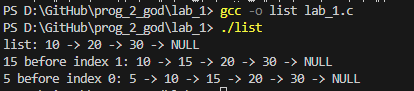

# lab_1
 
 ---

 ## Задание
На языке С написать функцию вставки нового элемента в односвязный список по
индексу. Реализовать один из двух возможных вариантов вставки: вставка перед или после
текущего элемента, где текущий элемент определяется по заданным индексом.
```c
#include <stdio.h>
#include <stdlib.h>

typedef struct Node {
    int data;
    struct Node* next;
} Node;

Node* createNode(int data) {
    Node* newNode = (Node*)malloc(sizeof(Node));
    if (!newNode) {
        printf("Ошибка выделения памяти\n");
        exit(1);
    }
    newNode->data = data;
    newNode->next = NULL;
    return newNode;
}

void insertBefore(Node** head, int index, int newData) {
    if (index < 0) {
        printf("Индекс должен быть >= 0\n");
        return;
    }

    Node* newNode = createNode(newData);

    if (index == 0) {
        newNode->next = *head;
        *head = newNode;
        return;
    }

    Node* current = *head;
    Node* prev = NULL;
    int currentIndex = 0;

    while (current != NULL && currentIndex < index) {
        prev = current;
        current = current->next;
        currentIndex++;
    }

    if (currentIndex != index) {
        printf("Индекс вне границ списка\n");
        free(newNode);
        return;
    }

    prev->next = newNode;
    newNode->next = current;
}

void printList(Node* head) {
    Node* temp = head;
    while (temp != NULL) {
        printf("%d -> ", temp->data);
        temp = temp->next;
    }
    printf("NULL\n");
}

int main() {
    Node* head = NULL;

    head = createNode(10);
    head->next = createNode(20);
    head->next->next = createNode(30);

    printf("list: ");
    printList(head);

    insertBefore(&head, 1, 15);
    printf("15 before index 1: ");
    printList(head);

    insertBefore(&head, 0, 5);
    printf("5 before index 0: ");
    printList(head);
    return 0;
}

```

1. [Markdown Cheat Sheet](https://www.markdownguide.org/cheat-sheet/)
