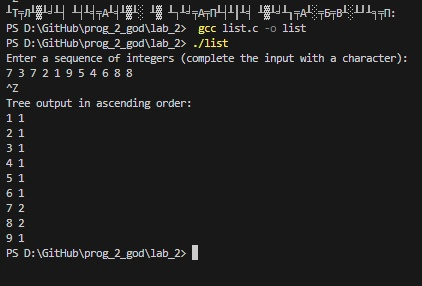

# lab_2
 
 ---

 ## Задание
По данной последовательности целых чисел постройте бинарное
дерево поиска, запоминая для каждого элемента последовательности его
значение и количество его повторений.
Входные данные
Вводится последовательность целых чисел.
Выходные данные
Выведите на экран содержимое дерева в порядке возрастания, по одному
элементу на строку. В каждой строке выводите значение элемента, затем,
через пробел, укажите, сколько раз он встречается в исходной
последовательности.
```c
#include <stdio.h>
#include <stdlib.h>

typedef struct Node {
    int value;
    int count;
    struct Node* left;
    struct Node* right;
} Node;

Node* createNode(int value) {
    Node* newNode = (Node*)malloc(sizeof(Node));
    newNode->value = value;
    newNode->count = 1;
    newNode->left = NULL;
    newNode->right = NULL;
    return newNode;
}

Node* insert(Node* root, int value) {
    if (root == NULL) {
        return createNode(value);
    }
    if (value == root->value) {
        root->count++;
    } else if (value < root->value) {
        root->left = insert(root->left, value);
    } else {
        root->right = insert(root->right, value);
    }
    return root;
}

void inOrderTraversal(Node* root) {
    if (root != NULL) {
        inOrderTraversal(root->left);
        printf("%d %d\n", root->value, root->count);
        inOrderTraversal(root->right);
    }
}

void freeTree(Node* root) {
    if (root != NULL) {
        freeTree(root->left);
        freeTree(root->right);
        free(root);
    }
}

int main() {
    Node* root = NULL;
    int value;

    printf("Enter a sequence of integers (complete the input with a character):\n");
    while (scanf("%d", &value) == 1) {
        root = insert(root, value);
    }

    printf("Tree output in ascending order:\n");
    inOrderTraversal(root);

    // Очистка памяти
    freeTree(root);

    return 0;
}


```

1. [Markdown Cheat Sheet](https://www.markdownguide.org/cheat-sheet/)
