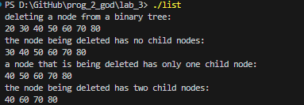

# lab_3
 
 ---
# Лабораторная работа №3
 ## Задание 
Реализовать операцию удаления узла из бинарного дерева поиска. Необходимо учесть три
возможных случая:
1. у удаляемого узла нет дочерних узлов,
2. у удаляемого узла есть только один дочерний узел,
3. у удаляемого узла два дочерних узла.
После выполнеия операции удаления узла бинарное дерево поиска должно сохранить свое
свойство: если x — узел бинарного дерева с ключом k, то все узлы в левом поддереве должны
иметь ключи, меньшие k, а в правом поддереве большие k. 

```c

#include <stdlib.h>
#include <stdio.h>

struct item {
  int data;
  struct item *next;
};

void print_list(const struct item *lst)
{
  printf("list: ");
  for(; lst; lst = lst->next)
    printf("%d ", lst->data);
  printf("\n");
}

struct item *array_to_list(int *arr, int size)
{
  struct item *tmp;
  if(!size)
    return NULL;
  tmp = malloc(sizeof(struct item));
  tmp->data = *arr;
  tmp->next = array_to_list(arr + 1, size - 1);
  return tmp;
}


void delete_element_list(struct item **pcur, int num)
{
  int counter = 1;
  while(*pcur) {  
    if(num == counter) {
      struct item *tmp = *pcur; 
      *pcur = (*pcur)->next;
      free(tmp);
      break;
    } else {
        pcur = &(*pcur)->next;
        counter++;
    }
  }
}

int main()
{
  int arr[] = {1, -2, 3, -4, 5};
  int size = sizeof(arr) / sizeof(*arr);
  struct item *lst = array_to_list(arr, size);
  
  print_list(lst);
  
  delete_element_list(&lst, 1);
  print_list(lst);
  
  delete_element_list(&lst, 3);
  print_list(lst);
  
  return 0;
}
```



1. [Markdown Cheat Sheet](https://www.markdownguide.org/cheat-sheet/)
