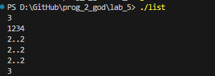
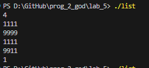

# lab_4
 
 ---

 ## Задание
Тимофей ищет место, чтобы построить себе дом. Улица, на которой он хочет жить, имеет
длину n, то есть состоит из n одинаковых идущих подряд участков. Каждый участок либо
пустой, либо на нём уже построен дом.
Общительный Тимофей не хочет жить далеко от других людей на этой улице. Поэтому
ему важно для каждого участка знать расстояние до ближайшего пустого участка. Если участок
пустой, эта величина будет равна нулю — расстояние до самого себя.
Помогите Тимофею посчитать искомые расстояния. Для этого у вас есть карта улицы.
Дома в городе Тимофея нумеровались в том порядке, в котором строились, поэтому их номера
на карте никак не упорядочены. Пустые участки обозначены нулями.
Формат ввода
В первой строке дана длина улицы —– n (1 ≤ n ≤ 106
). В следующей строке записаны n
целых неотрицательных чисел — номера домов и обозначения пустых участков на карте
(нули). Гарантируется, что в последовательности есть хотя бы один ноль. Номера домов
(положительные числа) уникальны и не превосходят 109
.
Формат вывода
Для каждого из участков выведите расстояние до ближайшего нуля. Числа выводите в
одну строку, разделяя их пробелами.
### Пример 1
Ввод            Вывод 
5               0 1 2 1 0
0 1 4 9 0       
### Пример 2
Ввод            Вывод
6               1 2 3 4 5
0 7 9 4 8 20

```c
#include <stdio.h>
#include <stdlib.h>

void calculate_distances(int n, int *street, int *distances) {
    int last_zero = -1;

    for (int i = 0; i < n; i++) {
        if (street[i] == 0) {
            last_zero = i;
        }
        distances[i] = (last_zero == -1) ? n : i - last_zero;
    }

    last_zero = -1;
    for (int i = n - 1; i >= 0; i--) {
        if (street[i] == 0) {
            last_zero = i;
        }
        if (last_zero != -1) {
            distances[i] = (distances[i] < last_zero - i) ? distances[i] : last_zero - i;
        }
    }
}

int main() {
    int n;
    scanf("%d", &n);

    int *street = (int *)malloc(n * sizeof(int));
    int *distances = (int *)malloc(n * sizeof(int));

    for (int i = 0; i < n; i++) {
        scanf("%d", &street[i]);
    }

    calculate_distances(n, street, distances);

    for (int i = 0; i < n; i++) {
        printf("%d ", distances[i]);
    }
    printf("\n");

    free(street);
    free(distances);

    return 0;
}


```
### Пример 1
Ввод            Вывод 
5               0 1 2 1 0
0 1 4 9 0   

### Пример 2
Ввод            Вывод
6               1 2 3 4 5
0 7 9 4 8 20

1. [Markdown Cheat Sheet](https://www.markdownguide.org/cheat-sheet/)
